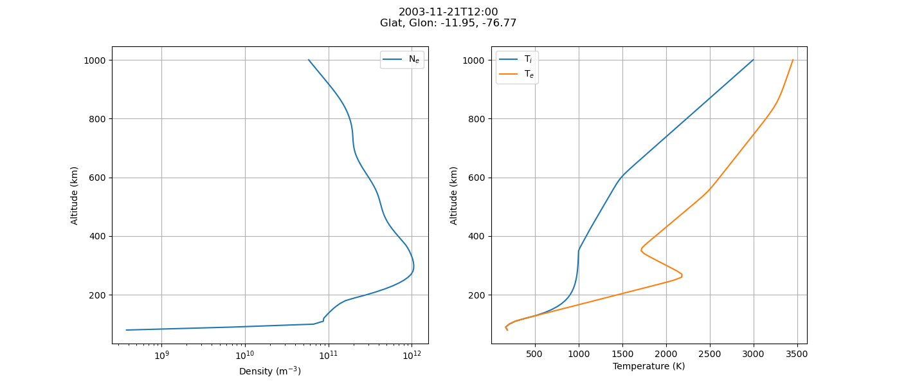
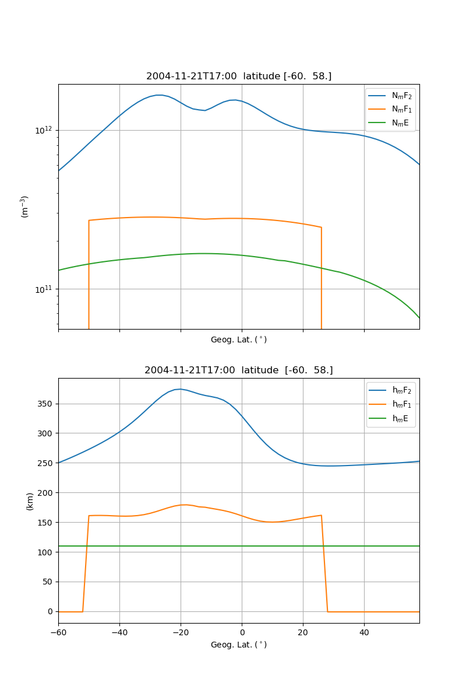
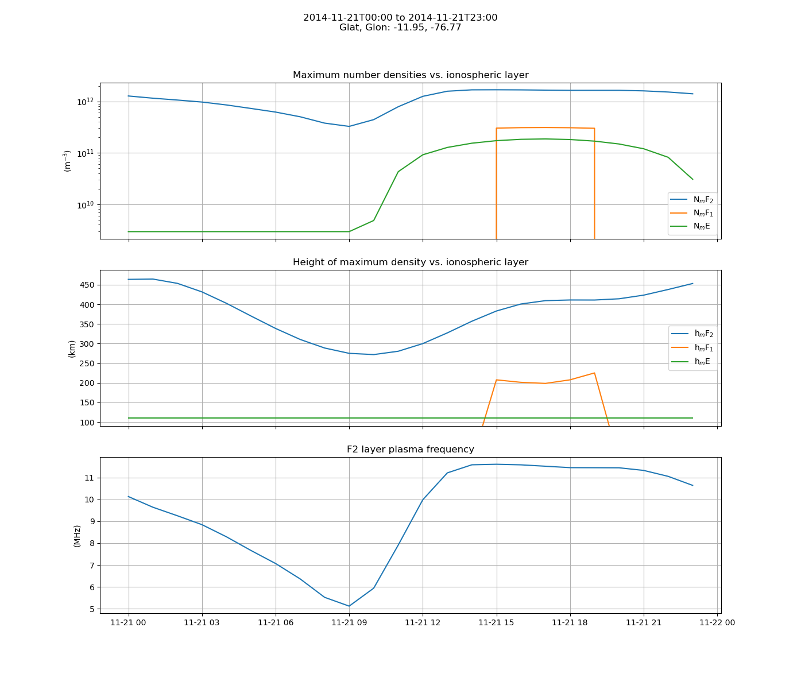
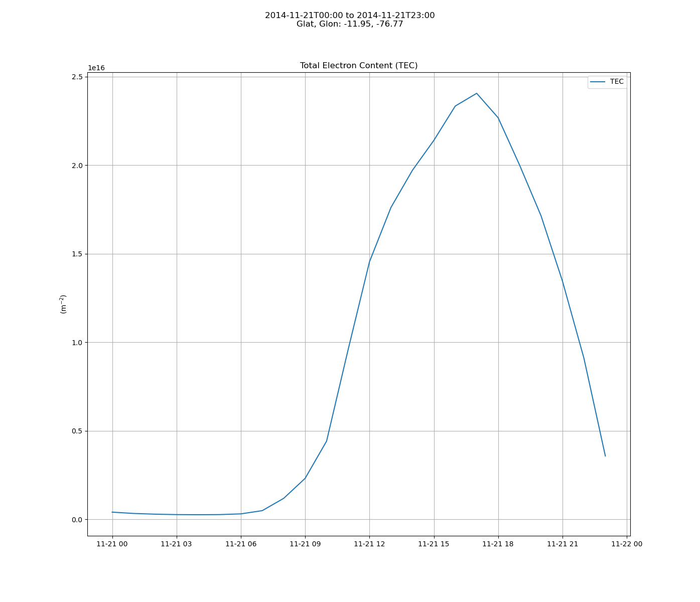

# IRI2020 ionosphere model from Python and Matlab

[](https://doi.org/10.5281/zenodo.240895)
[](https://github.com/space-physics/iri2020/actions/workflows/ci.yml)
[](https://www.mathworks.com/matlabcentral/fileexchange/81056-iri2020)
[](https://pypi.python.org/pypi/iri2020)
[](https://pepy.tech/project/iri2020)

Python and [Matlab](#matlab) interfaces to the International Reference Ionosphere (IRI) 2020 model.
A Fortran compiler is required to build the IRI2020 code.

## Install

Prerequisites

* Fortran compiler--any modern Fortran compiler will do. Here's how to get Gfortran:
  * Linux: `apt install gfortran`
  * Mac: `brew install gcc`
  *  Windows Subsystem for Linux

and then install latest release:

```sh
pip install iri2020
```

if you want the latest development version:

```sh
git clone https://github.com/space-physics/iri2020

pip install -e iri2020/
```

This Python wrapper of IRI2020 uses our build-on-run technique.
On the first run or `iri2020.IRI()` the Fortran code is built--we call this "build on run".

If you have errors about building on the first run, ensure that your Fortran compiler is specified in environment variable FC--this is what most build systems use to indicate the desired Fortran compiler (name or full path).

## Usage

* Altitude Profile: plot density and temperatures vs altitude

  ```sh
  python -m iri2020.altitude 2003-11-21T12 -11.95 -76.77
  ```

  
* Latitude profile: plot densities and height at the peak of F2, F2, and E regions vs geographic latitude

  ```sh
  python -m iri2020.latitude 2004-11-21T17 -76.77
  ```

  
* Time profile: plot densities and height at the peak of F2, F2, and E regions vs UTC

  ```sh
  python -m iri2020.time 2014-11-21 2014-11-22 1 -11.95 -76.77
  ```

  

  

### setting JF flags

IRI has a few dozen
[logical flags](https://irimodel.org/IRI-Switches-options.pdf)
stored in variable JF.
To reconfigure those flags, edit
[iri_driver.f90](./iri2020/src/iri_driver.f90)
and recompile iri2020_driver executable.

### Matlab

IRI2020 is readily accessible from Matlab.
From within Matlab verify everything is working by:

```matlab
TestAll
```

The [Examples](./Examples) directory has simple example use with plots.


## Data files

`src/iri2020/data/{apf107.dat,ig_rz.dat}`
[data files](https://irimodel.org/indices/IRI-Format-indices-files.pdf)
are
[regularly updated](http://irimodel.org/indices/).
Currently we don't auto-update those.
